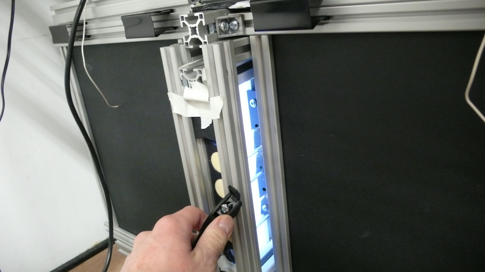
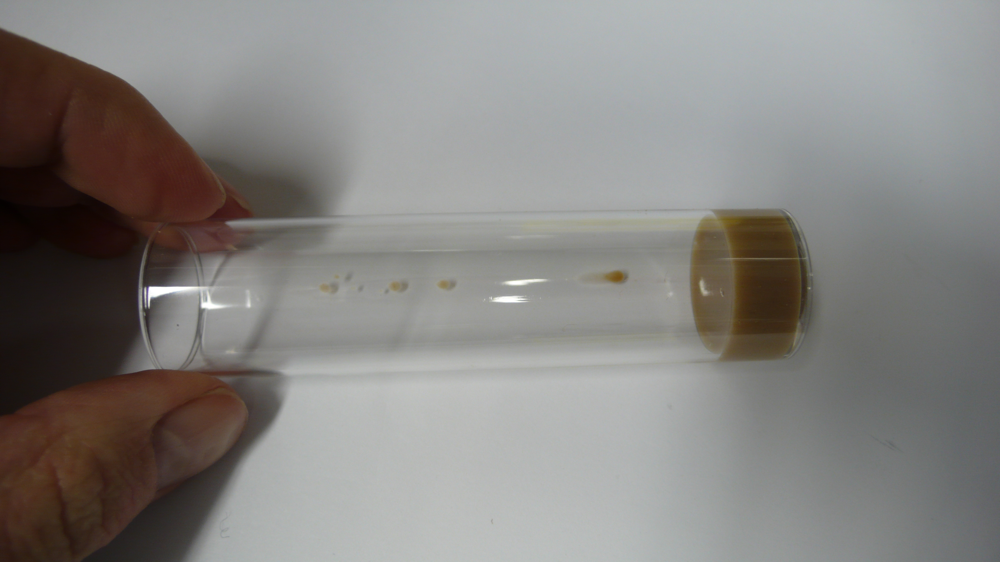
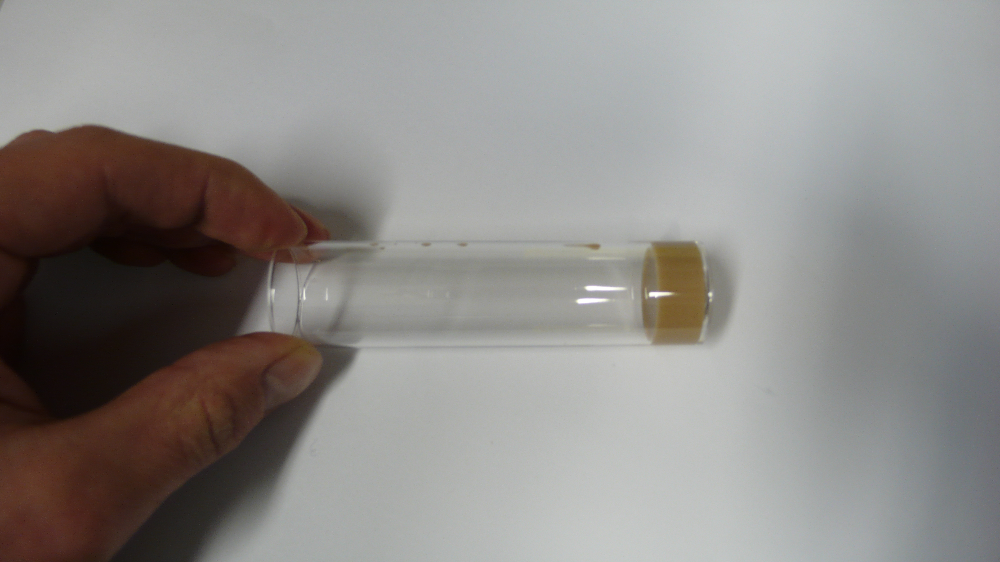
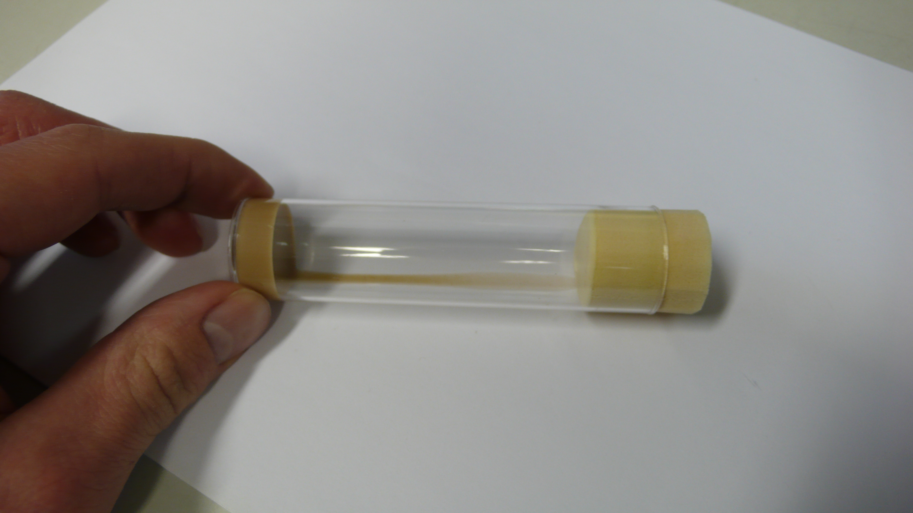
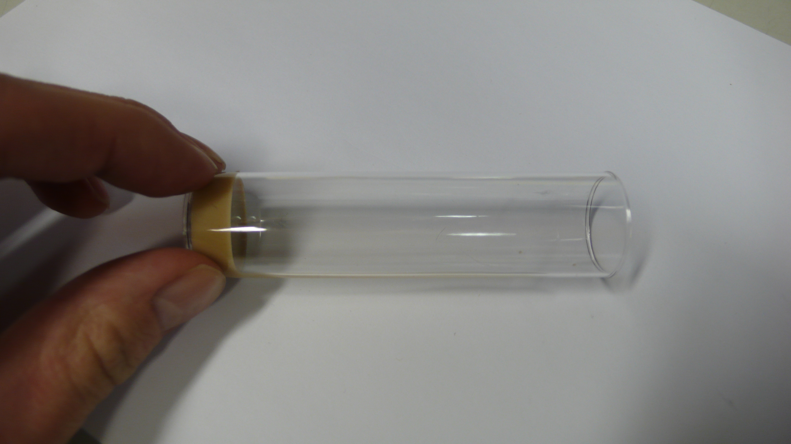

==============================
Instructions: Exchanging vials
==============================

Opening of box
==============

Close the capturing application and pull the vial try out by the handle.

    
Selection of good vial
======================

For a good capturing process, it is crucial to select vials which are as clean as possible. However, it is possible to use vials which have dirt only on one side. Below are example images of vials that are not perfectly clean, but still useable.

Compare the following vial with some food drops which appears only along the vertical axis of one side of the vial.

If rotated appropriately, this food drops will not be much visible for the camera inside the recording box.

    
Similarly, vial with broader stains on the vial wall can still be used, if the food becomes invisible after rotating the dirty part 90 degrees.

    
Rotated:

    
.. note:: Any kind of dirt in or on the vial is suboptimal. Use as clean vials as possible.

Inserting of a new vial into the tray
=====================================

Insert the vial "top-first" into the shelfing. The plug should fit through the hole in the tray as well as the plastic vial should have space enough to move slightly.

.. image:: ../../../../images/L1010495.JPG
    :scale: 20

Once the vial is in the shelf, make sure it is rotated appropriately. To rotate the vial, put the tray on the egde and touch the vial on its upper end. Preferibly, do not touch the vial anywhere where the fly might be filmed.

.. image:: ../../../../images/L1010496.JPG
    :scale: 20
    
Rotate the vial unto the food becomes the least visible.

.. image:: ../../../../images/L1010497.JPG
    :scale: 20
    
.. note:: If any vial is relatively dirty counter-check the vial orientation after putting the tray back into the box using the *./previewScript* command.

.. todo::
    previewScript and others need still to be documented
